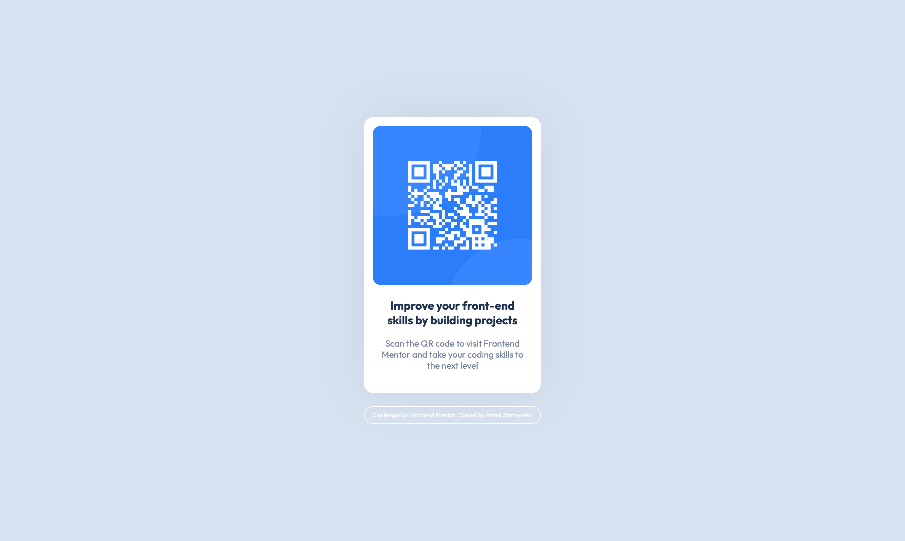

# Frontend Mentor - QR code component solution

This is a solution to the [QR code component challenge on Frontend Mentor](https://www.frontendmentor.io/challenges/qr-code-component-iux_sIO_H). Frontend Mentor challenges help you improve your coding skills by building realistic projects.

### Screenshot

### Links

- Solution URL: 
[html](https://github.com/antonistarzynski/qr-code-component/blob/main/index.html)
[css](https://github.com/antonistarzynski/qr-code-component/blob/main/style.css)
- Live Site URL: [QR code component](https://antonistarzynski.github.io/qr-code-component/)

### Built with

- Semantic HTML5 markup
- CSS custom properties
- Flexbox

